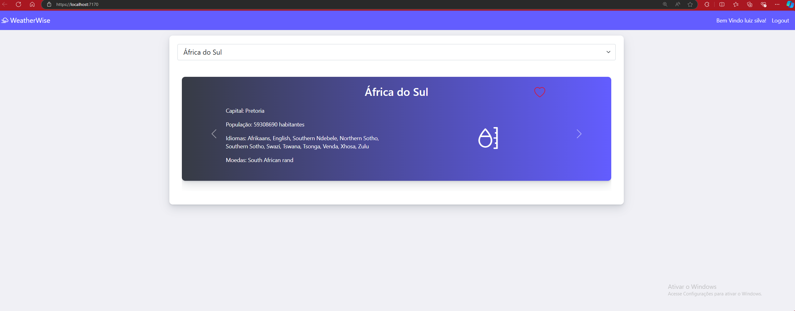
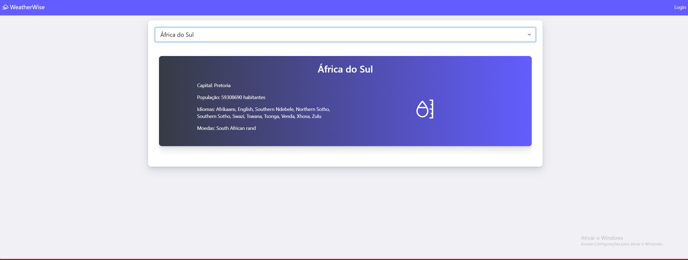
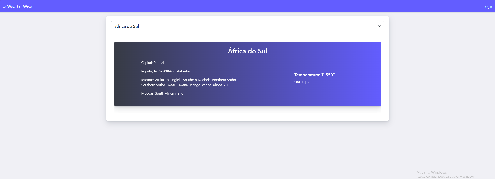
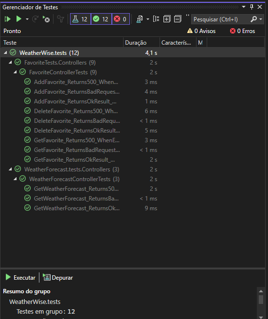
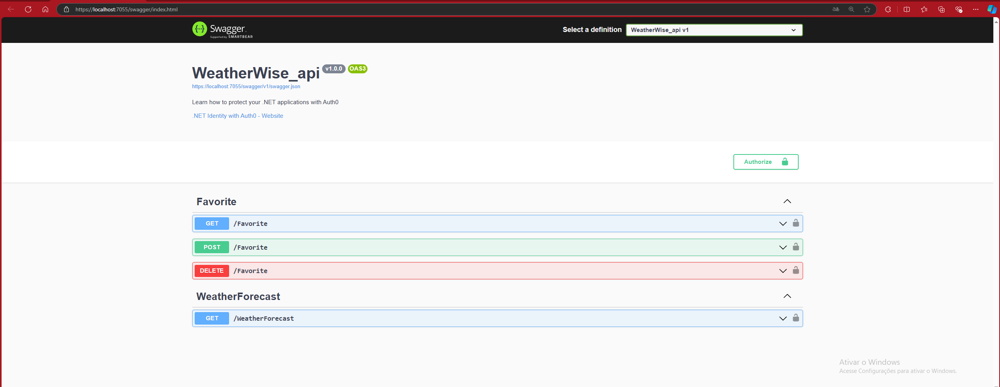
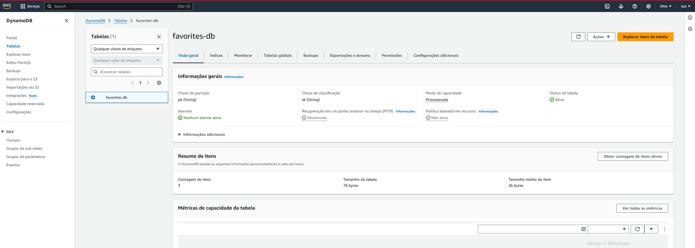
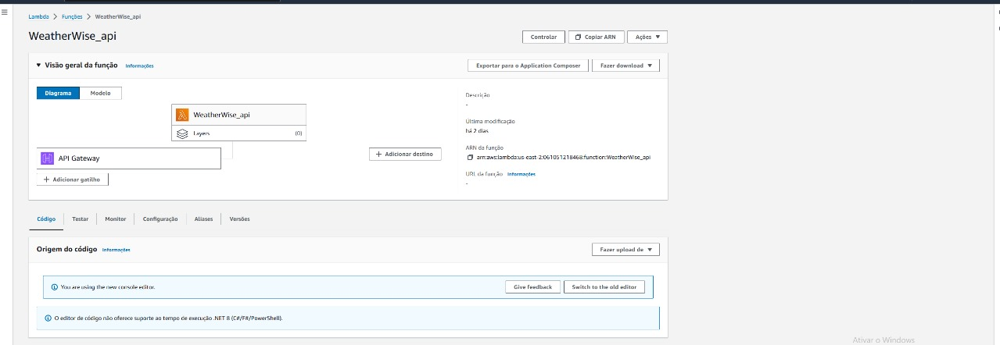

### Instruções:
- Substitua `[...]` pelo link do seu repositório.
- Verifique se os nomes dos arquivos de imagem correspondem ao que você tem.
- Sinta-se à vontade para ajustar o conteúdo conforme necessário!

# WeatherWise API

A **WeatherWise API** é um serviço desenvolvido em .NET 8 que fornece informações sobre o clima e permite que os usuários gerenciem seus locais favoritos.

## Configuração

1. **API Key da OpenWeatherMap**: É necessário registrar a `ApiKey` da OpenWeatherMap nas variáveis de ambiente na Lambda ou localmente via CMD. Para isso, execute o seguinte comando no PowerShell:

    ```bash
    $env:ApiKeyOW = "your-api-key-here"
    ```

2. **AWS Lambda**: A Lambda deve estar configurada na região `us-east-2` e deve ter permissão para acessar o DynamoDB. O nome da tabela é `favorites-db`.

## Decisões Tomadas

- **Utilização do Auth0 para Autenticação**: A API utiliza JWT para autenticação. O Auth0 foi escolhido devido ao tempo de desenvolvimento e por atender aos requisitos necessários. Caso haja a necessidade de avaliar o conhecimento em implementação do JWT, você pode acessar o repositório "[...]" onde desenvolvi uma aplicação utilizando JWT.

## Imagens

Aqui estão algumas capturas de tela da aplicação:

-  - Tela inicial com o usuário logado
-  - Tela inicial sem estar logado
-  - Tela quando o usuário clica para ver mais informações
-  - Gerenciador de testes com todos os testes concluídos
-  - Tela do Swagger mostrando todas as rotas
-  - Tela de login
-  - Print do site da AWS mostrando a tabela criada
-  - Print do site da AWS mostrando a Lambda criada

## Rotas da API

### 1. **Obter Favoritos**

- **Método**: `GET`
- **Rota**: `/Favorite`
- **Parâmetros**: 
  - `email`: O email do usuário.
- **Descrição**: Retorna a lista de locais favoritos do usuário.

### 2. **Adicionar Favorito**

- **Método**: `POST`
- **Rota**: `/Favorite`
- **Parâmetros**: 
  - `email`: O email do usuário.
  - `countryId`: O ID do país a ser adicionado como favorito.
- **Descrição**: Adiciona um novo favorito para o usuário.

### 3. **Remover Favorito**

- **Método**: `DELETE`
- **Rota**: `/Favorite`
- **Parâmetros**: 
  - `email`: O email do usuário.
  - `countryId`: O ID do país a ser removido dos favoritos.
- **Descrição**: Remove um país da lista de favoritos do usuário.

### 4. **Obter Previsão do Tempo**

- **Método**: `GET`
- **Rota**: `/WeatherForecast`
- **Parâmetros**:
  - `country`: O nome do país.
  - `capital`: O nome da capital.
- **Descrição**: Retorna as informações climáticas baseadas no país e capital fornecidos.

## Contribuição

Sinta-se à vontade para contribuir com o projeto, reportar problemas ou enviar pull requests.

## Licença

Este projeto está sob a licença MIT.
